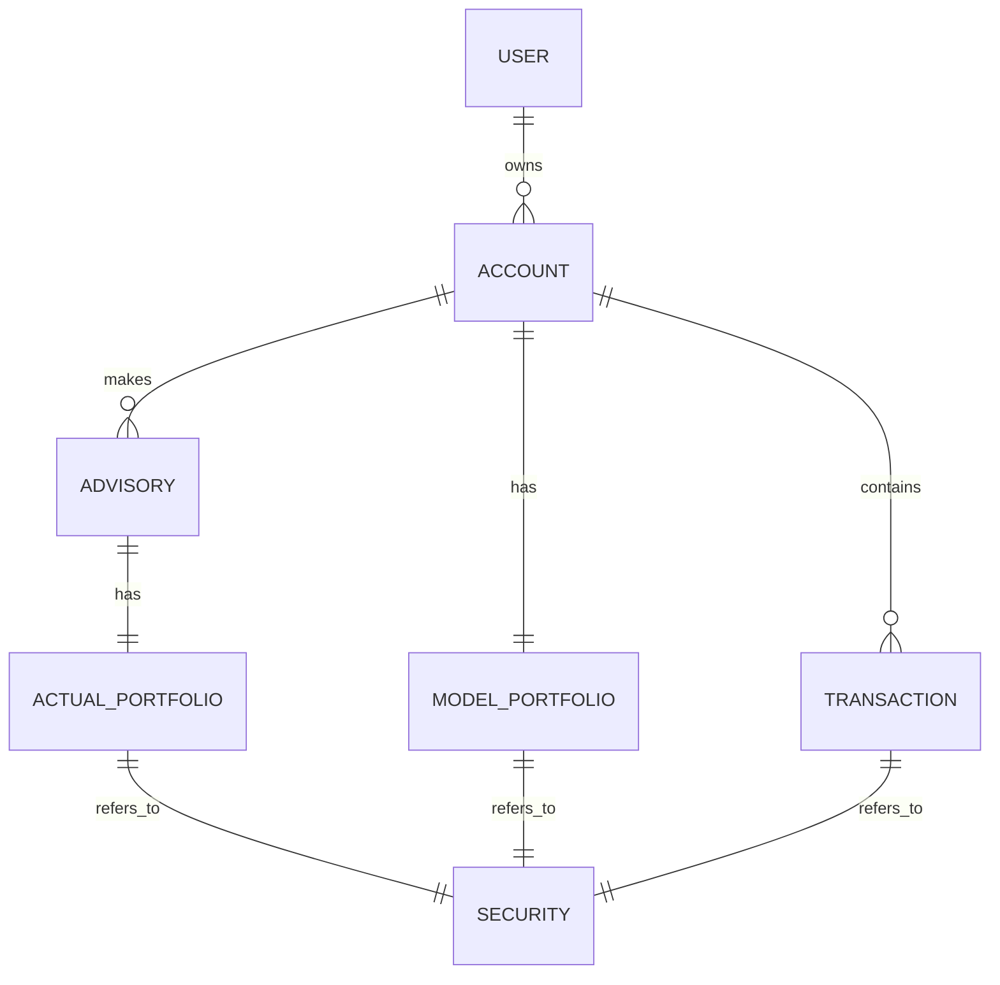

# [AIM] Backend Coding Test

> Simple portfolio management system with advisory features.

## Stack

- Kotlin
- Spring Boot
- Spring Security
- Spring Data R2DBC
- MySQL

## Project Structure



- ***User*** 는 여러 개의 ***Account*** 를 생성할 수 있습니다.
- ***Account*** 생성시엔 RiskType 을 선택해야 합니다.
- ***Advisory*** 요청시엔 ***Transaction(deposit)*** 과 ***ModelPortfolio*** 를 참고하여 ***ActualPortfolio*** 를 생성합니다.

## Getting Started

### Prerequisites

- Java 21 or higher
- Docker & Docker Compose

### Running the Application

1. Start the Database:
   ```bash
   docker-compose up -d
   ```

2. Build & Run the Application:
   ```bash
    ./gradlew clean bootRun
    ```

3. Execute Tests:
   ```bash
    ./gradlew test
    ```

## HTTP Request Collections (/misc/*.http)

All HTTP endpoints are catalogued under the misc directory as .http files for easy exploration and local testing using IntelliJ HTTP Client or similar
tools.

### Using the HTTP files

1. Open the .http files in IntelliJ or your preferred HTTP client.
2. Ensure the environment is selected (`http-client.env.json`)
3. Execute the requests to test the endpoints.