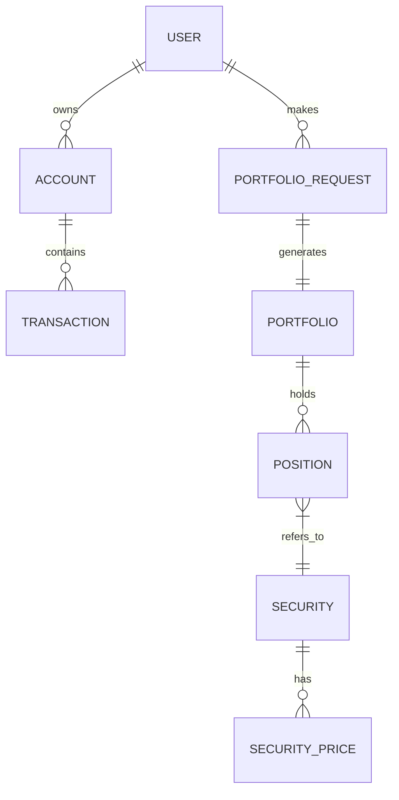

# [AIM] Backend Coding Test

```mermaid
erDiagram
    USER ||--o{ ACCOUNT           : owns
    ACCOUNT ||--o{ TRANSACTION     : contains
    USER ||--o{ PORTFOLIO_REQUEST : makes
    PORTFOLIO_REQUEST ||--|| PORTFOLIO : generates
    PORTFOLIO ||--o{ POSITION      : holds
    POSITION }|--|| SECURITY       : refers_to
    SECURITY ||--o{ SECURITY_PRICE : has
```